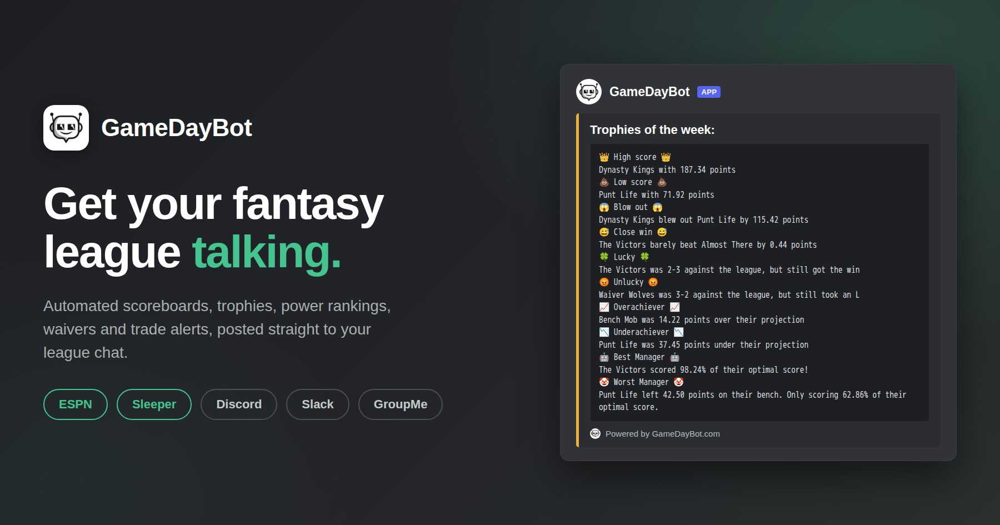
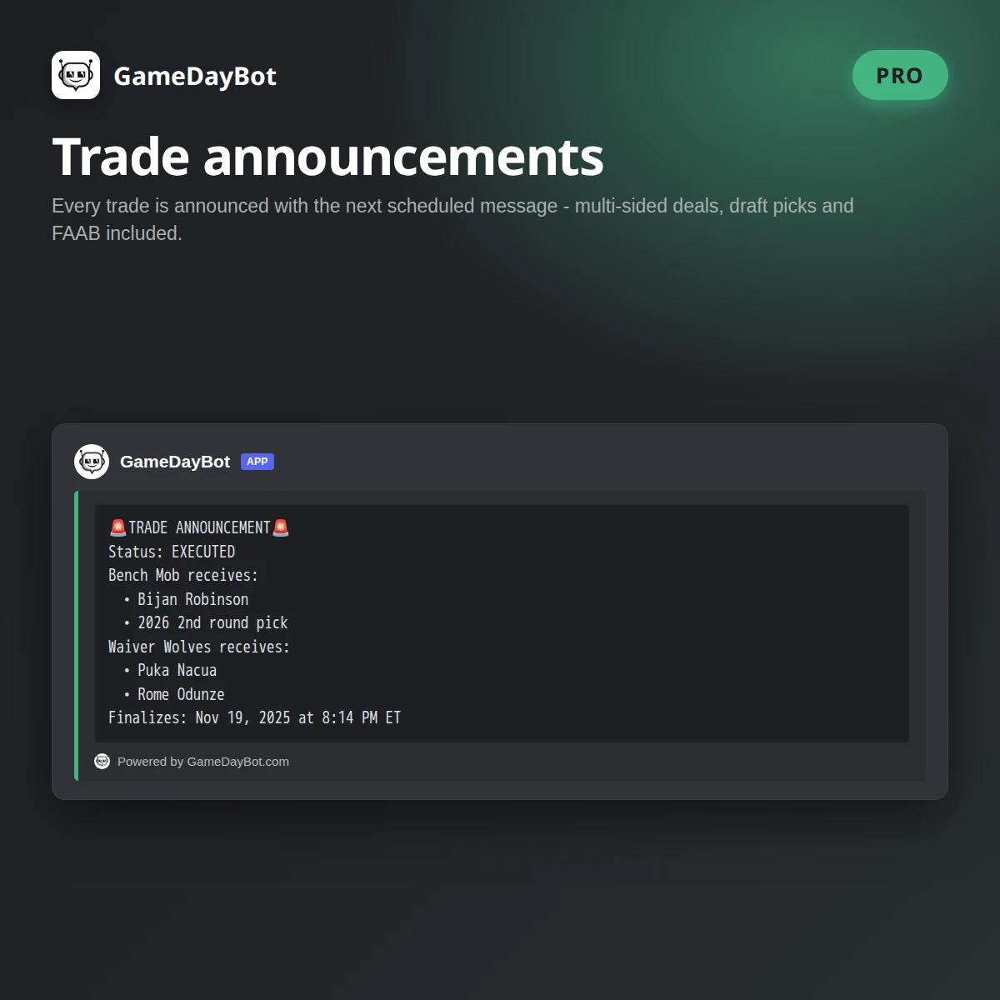
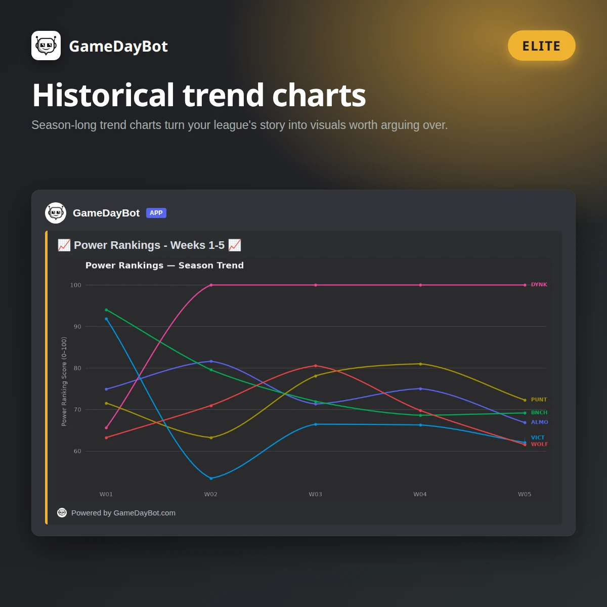
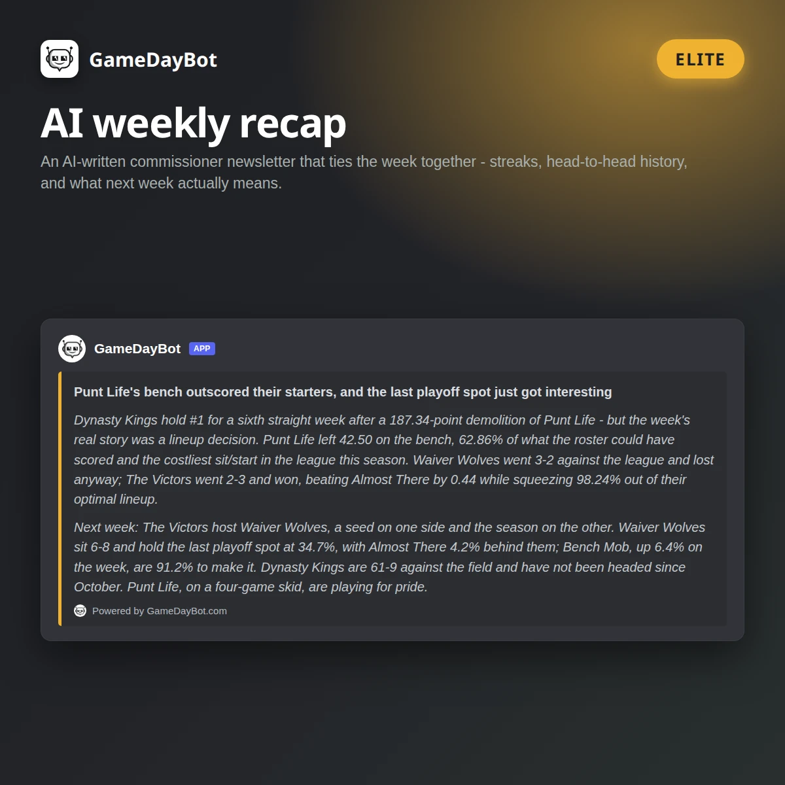

# Fantasy Football Chat Bot - ESPN → Discord, Slack, GroupMe


[](https://github.com/dtcarls/fantasy_football_chat_bot/releases/latest/)
[](https://github.com/dtcarls/fantasy_football_chat_bot/actions/workflows/test.yml)
[](https://github.com/dtcarls/fantasy_football_chat_bot/actions/workflows/publish_image.yaml)
[](https://www.gnu.org/licenses/gpl-3.0)


Automated league updates in your league's chat: scoreboards, standings, Power Rankings,
weekly trophies, waiver reports, matchup previews, and Players to Monitor - posted on a
schedule so nobody has to open the ESPN app to start an argument.

[](https://www.GameDayBot.com/)

**There are two ways to run it.** Pick the one that matches how much of your season you
want to spend on maintenance.

---

## Option 1: let us run it - [GameDayBot.com](https://www.GameDayBot.com/)

Same bot, none of the upkeep. No server, no config files, no season rollover, no cookie
refreshes. **Buy on the site and a setup wizard walks you through it** - connecting your
chat app and your league in a few clicks, instead of a tour of three developer portals.
Prefer Discord? Add it from the App Directory and run `/league_setup` instead. Either way
it's **ESPN and Sleeper** leagues, on **Discord, Slack and GroupMe**. Posting to league
chats since 2017.

### 👉 [Start a free 7-day trial at GameDayBot.com](https://www.GameDayBot.com/) 👈

The trial runs at the **top tier**, so you see everything before deciding. One per league.
On Discord you can add it straight from the
**[App Directory](https://discord.com/discovery/applications/1274439910077763728)**.

### What self-hosting actually costs

Not money - time, and always at the worst moment. None of this is hard; it's just never
finished:

| | Self-host (this repo) | [GameDayBot.com](https://www.GameDayBot.com/) |
|---|---|---|
| **Price** | Free, plus whatever the server costs | Less than a cheap VPS · 7-day free trial |
| **Setup** | Clone, set ~10 env vars, keep a box online 24/7 | A guided wizard after checkout - or add it from Discord and run `/league_setup` |
| **Connecting your chat app** | You create the webhook yourself, in each app: GroupMe's developer portal, a Slack app, a Discord webhook. Every screenshot below is that | One button for Discord, one for GroupMe - the wizard creates the bot for you. (Slack is still a pasted webhook URL) |
| **Adding your league** | Dig `leagueId` out of the ESPN URL | Paste the league URL - it's checked against ESPN on the spot, so a typo tells you immediately |
| **Knowing it worked** | Set `INIT_MSG`, restart, watch the chat, unset it, restart again | A **Send test message** button |
| **Uptime** | Yours. The process dies, the messages stop | Handled |
| **Every August** | Bump `LEAGUE_YEAR`, `START_DATE`, `END_DATE`, refresh ESPN cookies, pull the new release | Handled |
| **When ESPN changes their API** | Wait for the upstream fix, then redeploy | Handled |
| **A second league** | A second process with its own config | A second subscription, same server |
| **Changing a setting** | Edit env vars, restart the bot | `/configure_messages`, in chat |

### What you get, side by side

Everything this repo sends, the managed bot sends too. The difference is what's on top -
and how you drive it.

**The same messages, either way**

| | Self-host | GameDayBot.com |
|---|---|---|
| Scoreboards + projections, standings, matchups, Players to Monitor, Waiver Report, Power Rankings, Close Scores | ✅ | ✅ Pro |
| The full 10-trophy set with Tuesday's final scores | ✅ | ✅ Pro |
| Win Matrix and season Trophy Case | ✅ on demand, as text | ✅ Elite, sent automatically every week |

**Only on [GameDayBot.com](https://www.GameDayBot.com/)**

| | |
|---|---|
| 🏈 **Sleeper leagues** | Not just ESPN. The same schedule and the same messages for Sleeper, on the same three chat apps - one subscription per league either way |
| 💬 **Slash commands in Discord** | This repo is a one-way webhook: it posts, and can't be talked to. GameDayBot is a real Discord app. `/league_setup` adds a league, `/league_status` shows what's running, `/message_schedule` prints the week - at every tier. Pro adds `/configure_messages` to turn individual messages on and off, plus `/configure_timezone` and `/configure_close_scores`. No env vars, no redeploy, no server |
| 🔁 **Trade Announcements** *(Pro)* | Multi-sided deals, draft picks and FAAB included, announced with the next scheduled message |
| 🔔 **Team @mentions** *(Pro)* | Trophies and reports tag the actual manager, so the winner and the loser both get a notification |
| 📊 **The Elite analytics pack** | Historical trend charts for power rankings, scores and standings · the Bad Management chart · the Fortune Index · Win Matrix and Trophy Case on a weekly schedule · and an **AI weekly recap** written from your league's actual week |

<table>
<tr>
<td width="33%"></td>
<td width="33%"></td>
<td width="33%"></td>
</tr>
</table>

Subscribe annually on [GameDayBot.com](https://www.GameDayBot.com/) or monthly inside
Discord. One subscription covers one league, it auto-renews, and nothing expires
mid-season. Current plans and pricing are always on
[GameDayBot.com](https://www.GameDayBot.com/).

---

## Option 2: run it yourself

Everything below is for that, starting at [Self-hosting](#self-hosting). It's fully
supported and always will be - the same GPL-3.0 code the bot has always been, and the
managed service is built on it.

---

## Table of Contents

* [What it sends, and when](#what-it-sends-and-when)
* [What the messages look like](#what-the-messages-look-like)
* [Self-hosting](#self-hosting)
  * [What you need](#what-you-need)
  * [1. Set up your chat app](#1-set-up-your-chat-app)
  * [2. Get your ESPN league info](#2-get-your-espn-league-info)
  * [3. Configure](#3-configure)
  * [4. Run it](#4-run-it)
  * [Every season: the rollover checklist](#every-season-the-rollover-checklist)
  * [Running functions on demand](#running-functions-on-demand)
* [Development](#development)
* [FAQ](#faq)
* [Support](#support)
* [Donations](#donations)
* [License](#license)

---

## What it sends, and when

Times marked **local** use your `TIMEZONE` setting. Times marked **ET** are always
Eastern, because they're pinned to kickoff windows. Nothing sends outside `START_DATE`
to `END_DATE`, and the bot goes quiet once the league's matchup periods are over.

| Message | Day | Time | What it is |
|---|---|---|---|
| Players to Monitor | Sun | 7:30 AM local | Starters carrying an injury status, on a bye, or projected for 0 - plus anyone parked in an IR slot who isn't IR-eligible |
| Scoreboard + projections | Sun | 4:00 PM & 8:00 PM ET | Live scores as the afternoon and evening games land |
| Scoreboard + projections | Mon & Fri | 7:30 AM local | Morning recap of Thursday and Sunday |
| Close Scores | Mon | 6:30 PM ET | Games projected within `CLOSE_SCORES_THRESHOLD` points (15 by default) that still have players to play - the ones to watch on MNF |
| Final scores + trophies | Tue | 7:30 AM local | Last week's finals plus all 10 weekly awards |
| Power Rankings | Tue | 6:30 PM local | Two-step dominance rankings with week-over-week movement |
| Standings | Wed | 7:30 AM local | Current standings |
| Waiver Report | Wed | 7:31 AM local | Every add/drop from the day, with FAAB bids and the outbid rival in FAAB leagues |
| Matchups + projections | Thu | 7:30 PM ET | Next week's matchups with records |

Optional: `DAILY_WAIVER` moves the Waiver Report to a daily send, and `MONITOR_REPORT`
(on by default) controls the Sunday Players to Monitor message.

The managed schedule - including the daily Waiver Report and the Elite chart messages -
is at [gamedaybot.com/message-schedule](https://www.gamedaybot.com/message-schedule/).

## What the messages look like

Same text goes to every chat app you've configured; only the wrapping differs (Discord
turns the first line into an embed title, Slack wraps the message in a code block,
GroupMe sends it as-is).

<details>
<summary><b>Trophies</b> - the weekly awards, sent Tuesday with final scores</summary>

```
Trophies of the week:
👑 High score 👑
Dynasty Kings with 187.34 points
💩 Low score 💩
Punt Life with 72.18 points
😱 Blow out 😱
Dynasty Kings blew out Punt Life by 115.16 points
😅 Close win 😅
The Victors barely beat The Losers by 1.24 points
🍀 Lucky 🍀
Big Losers was 2-7 against the league, but still got the win
😡 Unlucky 😡
Almost There was 7-2 against the league, but still took an L
📈 Overachiever 📈
Dynasty Kings was 32.50 points over their projection
📉 Underachiever 📉
Punt Life was 28.75 points under their projection
🤖 Best Manager 🤖
The Victors scored 98.24% of their optimal score!
🤡 Worst Manager 🤡
Punt Life left 42.50 points on their bench. Only scoring 63.10% of their optimal score.
```
</details>

<details>
<summary><b>Scoreboard, Standings, Power Rankings, Matchups</b></summary>

```
Score Update
DKNG 120.34 -  98.56 PNLF
GRDG 145.22 - 134.18 VCTS
ALMT  87.50 - 102.44 BGLS

Approximate Projected Scores
DKNG 118.90 - 101.22 PNLF
GRDG 139.75 - 128.60 VCTS
ALMT  94.10 -  99.80 BGLS
```

```
Current Standings
 1: (10-3 ) Dynasty Kings
 2: ( 9-4 ) Gridiron Gods
 3: ( 8-5 ) The Victors
 4: ( 7-6 ) Almost There
 5: ( 5-8 ) Big Losers
 6: ( 3-10) Punt Life
```

```
Power Rankings (Playoff %)
99.99[🟢12.5%] (87.5) - DKNG
85.25[🔻 8.2%] (62.5) - VCTS
78.10[🟢 1.4%] (50.0) - GRDG
65.40[🟢 5.1%] (37.5) - ALMT
52.80[🔻 3.8%] (25.0) - BGLS
41.20[🔻 6.2%] (12.5) - PNLF
```

```
Matchups
Dynasty Kings vs Punt Life
Gridiron Gods vs The Victors
Almost There vs Big Losers

DKNG (8-4) vs (5-7) PNLF
GRDG (7-5) vs (9-3) VCTS
ALMT (6-6) vs (4-8) BGLS
```
</details>

<details>
<summary><b>Players to Monitor, Waiver Report, Close Scores</b></summary>

```
Starting Players to Monitor
Dynasty Kings:
QB Lamar Jackson - Questionable
WR Cooper Kupp - Out
TE Dalton Kincaid - BYE

Gridiron Gods:
K Justin Tucker - Projected 0
WR Puka Nacua - Not IR eligible
```

In FAAB leagues the Waiver Report says what the winning bid had to beat - the runner-up
is named when it was close, and the margin is shown when it wasn't:

```
Waiver Report 2026-10-15:
Dynasty Kings
ADDED QB - Josh Allen ($85, won by $40)
DROPPED QB - Gardner Minshew

Gridiron Gods
ADDED RB - Gus Edwards ($12, Punt Life outbid by $1)
DROPPED WR - Kendall Hinton
```

```
Projected Close Scores
DKNG 142.50 - 138.25 PNLF
GRDG 115.88 - 118.44 VCTS
```
</details>

---

# Self-hosting

> Don't run two copies of the bot in the same chat - you'll double every message. In
> general, let the commissioner do the setup.
>
> The next two steps - creating a webhook in each chat app, and pulling your league ID
> out of a URL - are the ones [GameDayBot.com](https://www.GameDayBot.com/)'s setup
> wizard does for you. If any of it stops being fun, it runs the same messages (plus
> Sleeper, slash commands, trades, @mentions and charts) with none of the upkeep.

## What you need

* **An ESPN fantasy football league** - public, or private with cookies (see below). The
  league must be full for ESPN's API to return usable data.
* **A chat destination** - a GroupMe bot ID, a Slack incoming webhook, and/or a Discord
  webhook. Set as many as you want; each configured platform gets every message.
* **Somewhere to run it 24/7.** The bot is a long-lived process with an internal cron
  scheduler - it has to stay running to send anything. A Raspberry Pi, a VPS, a
  home server, or any container host works.
* **Docker**, or **Python 3.9+** if you'd rather run it directly. The image and CI both
  use 3.11, so that's the best-tested version.

## 1. Set up your chat app

<details>
  <summary><b>GroupMe</b></summary>

Go to [groupme.com](https://www.groupme.com) and sign up or log in. If your league
doesn't have a group chat yet, create one.


Go to [dev.groupme.com/session/new](https://dev.groupme.com/session/new) and log in, then
click **Create Bot**.


Fill in the bot details - GroupMe explains each field.


After creating it, click **Edit**.


This page has the **Bot ID** you need for `BOT_ID`. You can send a test message from here
to confirm it reaches your chat.


</details>

<details>
  <summary><b>Slack</b></summary>

Sign in to your workspace at [slack.com/signin](https://slack.com/signin) and create a
channel for your league if you don't have one.

Create an app at [api.slack.com/apps/new](https://api.slack.com/apps/new) - name it and
pick the workspace.

Select **Incoming Webhooks** in the sidebar.


Toggle it **On**, then click **Add New Webhook to Workspace**.


Choose the channel to post in and click **Authorize**.

Copy the **Webhook URL** - that's `SLACK_WEBHOOK_URL`.


</details>

<details>
  <summary><b>Discord</b></summary>

Log in to Discord and open your server's settings.


Go to **Integrations → Webhooks**.


Create a webhook, name it, and pick the channel it posts to.


Copy the **Webhook URL** - that's `DISCORD_WEBHOOK_URL`.


</details>

## 2. Get your ESPN league info

**League ID** - open your league on [fantasy.espn.com](https://fantasy.espn.com) and take
the `leagueId` value out of the URL.

<details>
  <summary><b>Private leagues: ESPN_S2 and SWID</b></summary>

Private leagues need two cookies. Public leagues don't - including for the Waiver
Report, which reads ESPN's transactions endpoint and works unauthenticated.

**The easy way - a Chrome extension.** Install
[ESPN Private League Setup](https://chromewebstore.google.com/detail/espn-private-league-setup/bjmalaafoepfooflcnhjejnopgefjgia),
log in to ESPN, and it reads out your `ESPN_S2` and `SWID` for you. It's published by
gamedaybot.com, and the values work anywhere - here, or on the hosted service.

**By hand, if you'd rather not install anything:**

1. Log in to [fantasy.espn.com](https://fantasy.espn.com) in Chrome.
2. Right-click anywhere → **Inspect**.
3. **Application → Storage → Cookies → http://fantasy.espn.com**.
4. Copy the values of `espn_s2` and `SWID`.

`SWID` can be given with or without the surrounding `{}` - the bot adds them if missing.

These cookies expire (and are invalidated when you change your ESPN password). If the bot
suddenly can't see a private league, refresh them first before assuming something worse.
</details>

## 3. Configure

Everything is environment variables. Set at least one chat destination and `LEAGUE_ID`;
the rest have defaults.

| Variable | Required | Default | Description |
|---|---|---|---|
| `LEAGUE_ID` | **Yes** | - | Your ESPN league ID |
| `BOT_ID` | For GroupMe | - | Bot ID from the GroupMe developers page |
| `SLACK_WEBHOOK_URL` | For Slack | - | Incoming webhook URL from your Slack app |
| `DISCORD_WEBHOOK_URL` | For Discord | - | Webhook URL from your Discord channel |
| `LEAGUE_YEAR` | Recommended | `2026` | Season year. **Set it every season** - the default only tracks whichever season this release was cut for, and goes stale the moment the next one starts |
| `START_DATE` | Recommended | `2026-09-10` | Bot stays silent before this date (`YYYY-MM-DD`) |
| `END_DATE` | Recommended | `2027-01-10` | Bot stays silent after this date (`YYYY-MM-DD`) |
| `TIMEZONE` | No | `America/New_York` | [TZ identifier](https://en.wikipedia.org/wiki/List_of_tz_database_time_zones#List) for the "local" sends |
| `ESPN_S2` | Private leagues | - | ESPN cookie |
| `SWID` | Private leagues | - | ESPN cookie |
| `MONITOR_REPORT` | No | `True` | Sunday morning Players to Monitor message |
| `DAILY_WAIVER` | No | `False` | Send the Waiver Report daily rather than only on Wednesday |
| `CLOSE_SCORES_THRESHOLD` | No | `15` | Largest projected point gap that still counts as a close matchup. Lower it for fewer, tighter games. A value that isn't a whole number is ignored |
| `INIT_MSG` | No | - | Message posted on startup. Leave unset for a silent start - the process restarts more often than you'd think |

Two older variables, `WAIVER_REPORT` and `TEST`, are still read but no longer do
anything - leave them unset. `RANDOM_PHRASE` and `TOP_HALF_SCORING` have been removed
entirely; if either is still in your config, drop it.

## 4. Run it

<details open>
  <summary><b>Docker Compose</b> (easiest to keep running)</summary>

Edit the `environment:` block in [`docker-compose.yml`](docker-compose.yml) with your
values, then:

```bash
git clone https://github.com/dtcarls/fantasy_football_chat_bot
cd fantasy_football_chat_bot
docker compose up -d
```

`restart: always` is already set, so it comes back after a reboot. Logs:
`docker compose logs -f`.
</details>

<details>
  <summary><b>Docker</b></summary>

```bash
git clone https://github.com/dtcarls/fantasy_football_chat_bot
cd fantasy_football_chat_bot
docker build -t fantasy_football_chat_bot .

docker run -d --restart=always \
  -e LEAGUE_ID=1234567 \
  -e LEAGUE_YEAR=2026 \
  -e START_DATE=2026-09-10 \
  -e END_DATE=2027-01-10 \
  -e TIMEZONE=America/Chicago \
  -e DISCORD_WEBHOOK_URL="https://discord.com/api/webhooks/..." \
  fantasy_football_chat_bot
```

Prebuilt images are published to GHCR, so you can skip the build:

| Tag | What it points at |
|---|---|
| `ghcr.io/dtcarls/fantasy_football_chat_bot:latest` | The newest release |
| `ghcr.io/dtcarls/fantasy_football_chat_bot:v2026.09.10` | One specific release |
| `ghcr.io/dtcarls/fantasy_football_chat_bot:<commit-sha>` | One specific commit |

Every merge to `main` is built, tested, and released automatically under a dated tag -
`v2026.09.10`, and `v2026.09.10.1` for a second release the same day - which also moves
`latest`. Releases are listed on the
[releases page](https://github.com/dtcarls/fantasy_football_chat_bot/releases) with
generated notes.

Use `latest` if you'd rather `docker pull` and restart than track version numbers. Pin a
dated tag if you want to choose when you move: `latest` changes whenever `main` does.
</details>

<details>
  <summary><b>Python, no Docker</b></summary>

```bash
git clone https://github.com/dtcarls/fantasy_football_chat_bot
cd fantasy_football_chat_bot
pip install -r requirements.txt

export LEAGUE_ID=1234567
export LEAGUE_YEAR=2026
export DISCORD_WEBHOOK_URL="https://discord.com/api/webhooks/..."
python3 gamedaybot/espn/espn_bot.py
```

This runs in the foreground forever. Use `systemd`, `supervisord`, `tmux`, or anything
else that will restart it - if the process dies, the messages stop.
</details>

**Verify it's alive:** set `INIT_MSG` to anything, start the bot, confirm the message
lands in your chat, then unset it and restart.

## Every season: the rollover checklist

Nothing here is automatic. Before Week 1:

1. Set `LEAGUE_YEAR` to the new season.
2. Set `START_DATE` and `END_DATE` to the new season's window.
3. Refresh `ESPN_S2` / `SWID` if you use a private league - the
   [Chrome extension](https://chromewebstore.google.com/detail/espn-private-league-setup/bjmalaafoepfooflcnhjejnopgefjgia)
   makes this a few seconds.
4. Pull the latest release - ESPN changes their API most years, and the fix usually
   lands in [`espn-api`](https://github.com/cwendt94/espn-api) and gets picked up here.
5. Restart and confirm with an `INIT_MSG`.

If doing this every August is the part you'd rather skip,
[GameDayBot.com](https://www.GameDayBot.com/) handles all five and the mid-season cookie
expiry that isn't on this list.

## Running functions on demand

Every message type is a function name you can call directly - useful for testing without
waiting until Tuesday:

```bash
python3 -c "from gamedaybot.espn.espn_bot import espn_bot; espn_bot('get_standings')"
```

Valid names: `get_scoreboard_short`, `get_projected_scoreboard`, `get_matchups`,
`get_monitor`, `get_close_scores`, `get_power_rankings`, `get_trophies`, `get_standings`,
`get_final`, `get_waiver_report`, `win_matrix`, `trophy_recap`, `init`.

`win_matrix` (how the standings would look if everyone played everyone) and
`trophy_recap` (season-long trophy tally) aren't on the schedule - they're on-demand
only, and they read best at the end of a season.

---

## Development

```bash
git clone https://github.com/dtcarls/fantasy_football_chat_bot
cd fantasy_football_chat_bot

pip install -r requirements.txt
pip install -r requirements-test.txt

pytest                       # run the tests
pytest tests/test_utils.py   # run one file
```

Lint config is in `setup.cfg` (max line length 120). Note the pinned `flake8==3.3.0`
predates Python 3.11 and won't start on it - install a current flake8 to lint.

`tests/dry_run_all_functions.py` prints every message against a real league - handy for
eyeballing formatting changes before they hit a chat full of people.

Pull requests are welcome, especially fixes to ESPN parsing and support for additional
chat platforms.

## FAQ

**The bot isn't sending anything.**
Check, in order: the process is still running; today is between `START_DATE` and
`END_DATE`; `LEAGUE_YEAR` is the current season; your league is full; the webhook still
works (set `INIT_MSG` and restart). If you're still stuck, open an
[issue](https://github.com/dtcarls/fantasy_football_chat_bot/issues) or ask in the
[Discord](https://discord.gg/VFXSkcgjxh) so the answer helps the next person too.

**The Waiver Report is always empty.**
It only reports transactions from that same day, so a quiet waiver wire produces no
message at all - that's normal, not a failure. It does not need `ESPN_S2`/`SWID`; it
works on public leagues.

**How are Power Rankings calculated?**
Two-step dominance, weighted 80% dominance / 15% average points scored / 5% average
margin of victory. Watch the gaps between teams rather than the raw number.
[Algorithm source](https://github.com/cwendt94/espn-api/pull/12/files) ·
[dominance matrix explainer](https://www.youtube.com/watch?v=784TmwaHPOw).

**How do I change the timezone?**
Set `TIMEZONE` to a [TZ identifier](https://en.wikipedia.org/wiki/List_of_tz_database_time_zones#List),
e.g. `America/Chicago`. The Sunday scoreboards, Monday Close Scores and Thursday Matchups
stay on Eastern - they're tied to kickoff times, not to your league.

**Is there a version for Yahoo / CBS / NFL.com?**
Not in this repo. [GameDayBot.com](https://www.GameDayBot.com/) supports Sleeper
alongside ESPN.

**Is there a version for Messenger / WhatsApp / Teams?**
No, but pull requests adding a chat platform are welcome - see
[`gamedaybot/chat/`](gamedaybot/chat/) for how small a platform module is.

**Can I run this for two leagues?**
Run a second instance with its own config. One process serves one league. On
[GameDayBot.com](https://www.GameDayBot.com/) a second league is a second subscription in
the same server, with no second anything to deploy.

**What does the managed version do that this doesn't?**
Sleeper leagues, Discord slash commands (this repo is a one-way webhook - it can't be
talked to), Trade Announcements, team @mentions, and the Elite analytics pack: trend
charts, Bad Management, Fortune Index, a weekly Win Matrix and Trophy Case, and an AI
weekly recap. The [comparison above](#what-you-get-side-by-side) has the full split.

## Support

* [GitHub issues](https://github.com/dtcarls/fantasy_football_chat_bot/issues) - bugs and
  feature requests
* [Discord](https://discord.gg/VFXSkcgjxh) - troubleshooting and release notifications
* [GameDayBot on the Discord App Directory](https://discord.com/discovery/applications/1274439910077763728) -
  add the managed bot to a server
* support@gamedaybot.com - managed subscriptions

[](https://discord.gg/VFXSkcgjxh)

## Donations

If the bot made your league chat better, a coffee is always appreciated - or subscribe at
[GameDayBot.com](https://www.GameDayBot.com/) and let someone else run the server.

* **PayPal:** [](https://www.paypal.com/cgi-bin/webscr?cmd=_donations&business=ZDLFECJVGG6RG&currency_code=USD&source=url)
* **Venmo:** @dtcarls

Starring the repo helps too.

## License

[GPL-3.0](LICENSE).
